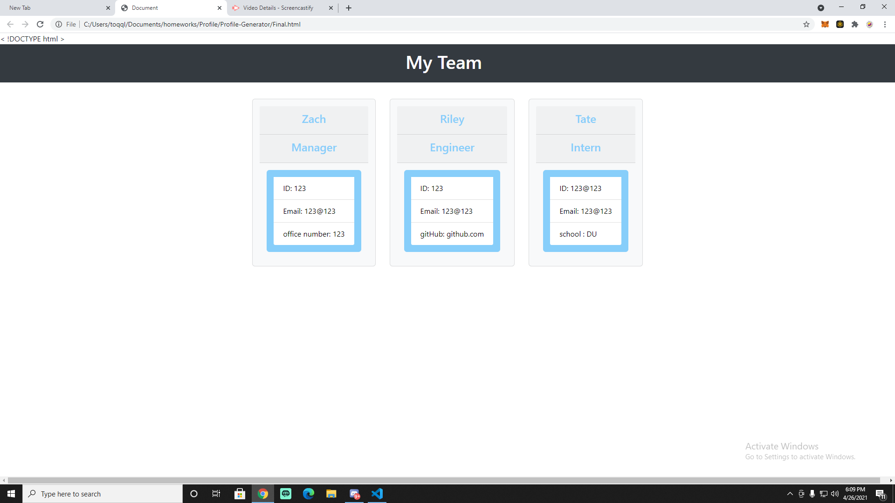
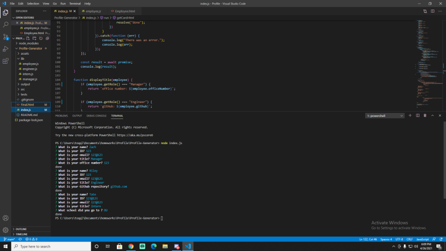

# For this project a client wanted to build a website to organize employees by title 

# We used node and js to create the app & generate a new HTML based on the given information. 

# To create a new HTML, use 'Node Index.js' in the terminal & enter your employees information.

# Demonstration 

